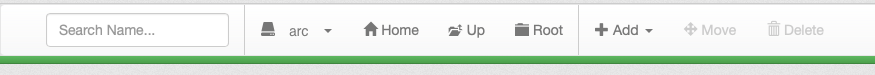
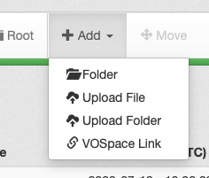
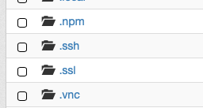
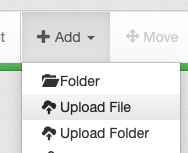
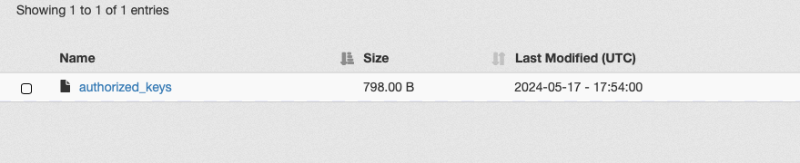

# Using SSHFS 

SSHFS, or the secure shell file system, allows users to interact with
the directories and files from their Science Portal account directly on
their local machine.

## Installation

Software installation is required to use this tool.

*Linux*: SSHFS is Linux-based software that needs to be installed on
your local computer. On Ubuntu and Debian based systems, it can be
installed through apt-get:

    sudo apt-get install sshfs

*Mac OSX*: Often SSHFS is already installed; if not, you will need to
download FUSE and SSHFS from the [osxfuse
site](https://osxfuse.github.io)

## Prepare your Arc account

A public SSH key will need to be installed into your Arc home directory.  Ensure you have a `.ssh` folder in your `/home/[your_cadc_username]` folder.  You can do this through the UI:

https://www.canfar.net/storage/arc/list/home

1. Ensure you are logged in using the pulldown in the top right menu.
> 

2. Visit your `Home` folder.
> 

3. If there is no `.ssh` folder listed, create one.
> 

> 

> 

4. Ensure you have a file called `authorized_keys` with your SSH public key in it.  This public key should match which ever private key you are using to authenticate with.  For example, if your private key on your local machine is `${HOME}/.ssh/id_rsa`, then your public key is likely `${HOME}/.ssh/id_rsa.pub`.
> 

5. Upload the `authorized_keys` file to the newly created `.ssh` folder on Arc by following the link to the folder in the browser, then `Upload`ing the file
> 

> 

> 

Now you can proceed to mounting it.

## Mount the Remote File System

For Ubuntu/Debian Linux or Mac OSX, the instructions are below.
Instructions for Windows users can be found at the bottom of
[this](https://www.digitalocean.com/community/tutorials/how-to-use-sshfs-to-mount-remote-file-systems-over-ssh)
page.

To start, we will need to create a local directory in which to mount the
file system, "arc":

    mkdir $HOME/arc

Now we can mount the file system locally using the following command,
based on which OS you are running. You will be asked for your CADC
password during this step.

*On Ubuntu/Debian*:

    sshfs -o reconnect,ServerAliveInterval=15,ServerAliveCountMax=10 -p 64022 [your_cadc_username]@ws-uv.canfar.net:/ $HOME/arc

*On Mac OSX*:

    sshfs -o reconnect,ServerAliveInterval=15,ServerAliveCountMax=10,defer_permissions -p 64022 [your_cadc_username]@ws-uv.canfar.net:/ $HOME/arc

The extra `defer_permissions` switch works around issues with OSX
permission handling. See [this
page](https://github.com/osxfuse/osxfuse/wiki/Mount-options#default_permissions-and-defer_permissions)
for more details.

## Synch Local and Remote Directories with rsync

With the steps above in place, the rsync ("remote synch") command can
be used. rsync uses an algorithm that minimizes the amount of data
copied by only moving the portions of files that have changed. Further
rsync examples and docs are
[here](https://www.digitalocean.com/community/tutorials/how-to-use-rsync-to-sync-local-and-remote-directories).

The synch is performed using the following:

    rsync -vrltP source_dir $HOME/arc/destination_dir/

where

-   `-v` increases verbosity
-   `-r` recurses into directories
-   `-l` copies symlinks as symlinks
-   `-t` preserves modification times (use the command `man rsync` for
    more details on why this option prevents resending already
    transferred data when not using `-a`)
-   `-P` keeps partially transferred files and shows progress during
    transfer

Pro tip: including a `/` after source_dir in the command above will
transfer the directory contents without the main directory itself. i.e.,
if your source_dir contains a file called test, then :

    rsync -vrltP source_dir $HOME/arc/destination_dir/

will add in the file as `$HOME/arc/destination_dir/source_dir/test`
whereas:

    rsync -vrltP source_dir/ $HOME/arc/destination_dir/

will add in the file as `$HOME/arc/destination_dir/test`

## Unmounting the File System

If you have finished working with your files and want to disconnect from
the remote file system, you can do this by:

    umount $HOME/arc

NB: If you run into problems with the original sshfs command and need to
run it again, you will likely need to unmount first.
